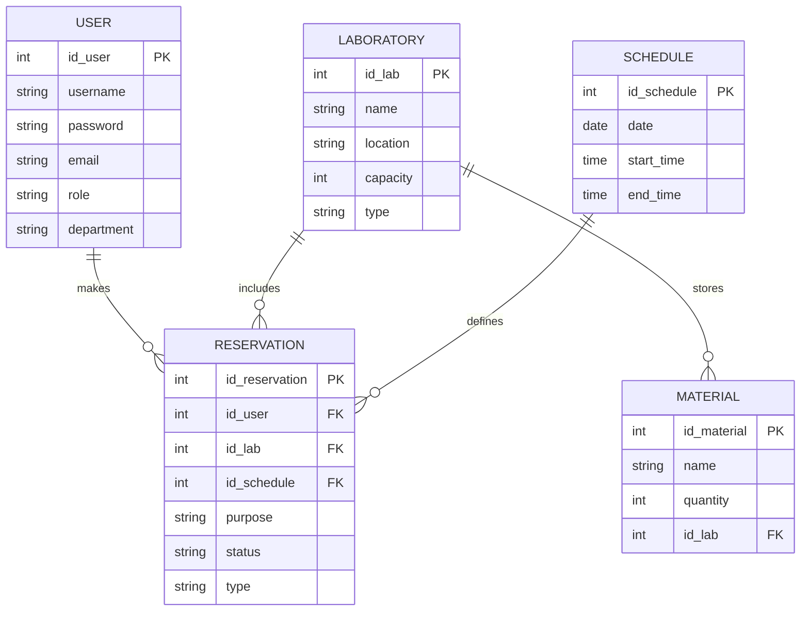

<script src="https://rawcdn.githack.com/oscarmorrison/md-page/master/md-page.js"></script><noscript></noscript>

# Documentación de LabTimeManager
---
[Regresar al LabTimeManager](/Proyectos/LabTimeManager/Inicio.md)
[Inicio](/)

---

**LabTimeManager** es una aplicación diseñada para gestionar eficientemente los laboratorios en instituciones académicas y de investigación. Proporciona funcionalidades para la reserva de laboratorios, gestión de materiales, horarios, usuarios, y generación de reportes. Esta documentación ofrece una guía detallada sobre la arquitectura del proyecto, las tecnologías utilizadas, y cómo está organizado el código.

## Índice

1. [Introducción](#introducción)
2. [Arquitectura del Proyecto](#arquitectura-del-proyecto)
3. [Tecnologías Utilizadas](#tecnologías-utilizadas)
4. [Organización del Código](#organización-del-código)
5. [Configuración de la Base de Datos](#configuración-de-la-base-de-datos)
6. [Conexión a la Base de Datos](#conexión-a-la-base-de-datos)
7. [Detalles de las Clases y Métodos](#detalles-de-las-clases-y-métodos)
8. [Interfaz de Usuario](#interfaz-de-usuario)
9. [Guía de Instalación](#guía-de-instalación)
10. [Pruebas](#pruebas)

## Introducción

**LabTimeManager** facilita la gestión de laboratorios al permitir reservas de recursos, administración de horarios, y seguimiento de uso. El proyecto fue desarrollado para abordar los desafíos de la gestión manual de laboratorios y proporcionar una solución automatizada que mejora la eficiencia y accesibilidad.

## Arquitectura del Proyecto

El proyecto sigue una arquitectura cliente-servidor, donde la aplicación cliente es una aplicación de escritorio desarrollada en Java, y el servidor es una base de datos MySQL que almacena toda la información necesaria. La conexión entre el cliente y el servidor se realiza a través de JDBC.



## Tecnologías Utilizadas

- **Lenguaje de Programación**: Java
- **Base de Datos**: MySQL
- **Interfaz Gráfica**: Swing
- **Librerías**:
  - JDBC: Para la conexión a la base de datos
  - FlatLaf: Para mejorar el aspecto visual de la interfaz gráfica
  - Apache PDFBox: Para la generación de reportes en PDF

## Organización del Código

El código está organizado en varios paquetes y clases para mantener la modularidad y facilitar el mantenimiento. A continuación se describen los paquetes y clases principales:

- **Windows**: Contiene las clases relacionadas con la interfaz gráfica del usuario.
  - `LoginWindow.java`: Maneja la autenticación de usuarios.
  - `UserDashboard.java`: Proporciona la interfaz para los usuarios estándar.
  - `AdminDashboard.java`: Proporciona la interfaz para los administradores.
  - **Diálogos**:
    - `ScheduleViewDialog.java`: Permite a los usuarios ver los horarios disponibles.
    - `ReservationDialog.java`: Permite a los usuarios realizar reservas.
    - `ModifyUsersDialog.java`: Permite a los administradores gestionar usuarios.
    - `ModifyLabsDialog.java`: Permite a los administradores gestionar laboratorios.
    - `ModifyMaterialsDialog.java`: Permite a los administradores gestionar materiales.
    - `ModifyScheduleDialog.java`: Permite a los administradores gestionar horarios.
    - `EditConfigDialog.java`: Permite modificar la configuración de la base de datos.
- **Model**: Contiene las clases que representan las entidades del sistema.
  - `User.java`: Representa a un usuario.
  - `Laboratory.java`: Representa a un laboratorio.
  - `Schedule.java`: Representa un horario.
  - `Reservation.java`: Representa una reserva.
  - `Material.java`: Representa un material.

## Configuración de la Base de Datos

El script SQL para crear la base de datos y las tablas necesarias está incluido en la documentación. Asegúrate de ejecutar este script en tu servidor MySQL antes de intentar conectar la aplicación.

```sql
-- Creación de la base de datos
CREATE DATABASE IF NOT EXISTS LabTimeManager;
USE LabTimeManager;

-- Creación de la tabla 'USER'
CREATE TABLE IF NOT EXISTS `USER` (
    id_user INT AUTO_INCREMENT PRIMARY KEY,
    username VARCHAR(255) NOT NULL,
    password VARCHAR(255) NOT NULL,
    email VARCHAR(255) NOT NULL UNIQUE,
    role VARCHAR(50) NOT NULL,
    department VARCHAR(100)
);

-- Creación de la tabla 'LABORATORY'
CREATE TABLE IF NOT EXISTS `LABORATORY` (
    id_lab INT AUTO_INCREMENT PRIMARY KEY,
    name VARCHAR(255) NOT NULL,
    location VARCHAR(255) NOT NULL,
    capacity INT NOT NULL,
    type VARCHAR(50) NOT NULL
);

-- Creación de la tabla 'SCHEDULE'
CREATE TABLE IF NOT EXISTS `SCHEDULE` (
    id_schedule INT AUTO_INCREMENT PRIMARY KEY,
    date DATE NOT NULL,
    start_time TIME NOT NULL,
    end_time TIME NOT NULL
);

-- Creación de la tabla 'RESERVATION'
CREATE TABLE IF NOT EXISTS `RESERVATION` (
    id_reservation INT AUTO_INCREMENT PRIMARY KEY,
    id_user INT NOT NULL,
    id_lab INT NOT NULL,
    id_schedule INT NOT NULL,
    purpose VARCHAR(255) NOT NULL,
    status VARCHAR(50) NOT NULL,
    type VARCHAR(50) NOT NULL,
    FOREIGN KEY (id_user) REFERENCES USER(id_user),
    FOREIGN KEY (id_lab) REFERENCES LABORATORY(id_lab),
    FOREIGN KEY (id_schedule) REFERENCES SCHEDULE(id_schedule)
);

-- Creación de la tabla 'MATERIAL'
CREATE TABLE IF NOT EXISTS `MATERIAL` (
    id_material INT AUTO_INCREMENT PRIMARY KEY,
    name VARCHAR(255) NOT NULL,
    quantity INT NOT NULL,
    id_lab INT NOT NULL,
    FOREIGN KEY (id_lab) REFERENCES LABORATORY(id_lab)
);

-- Creación de la tabla 'RESERVATION_MATERIAL'
CREATE TABLE IF NOT EXISTS `RESERVATION_MATERIAL` (
    id_reservation INT NOT NULL,
    id_material INT NOT NULL,
    quantity INT NOT NULL,
    FOREIGN KEY (id_reservation) REFERENCES RESERVATION(id_reservation),
    FOREIGN KEY (id_material) REFERENCES MATERIAL(id_material),
    PRIMARY KEY (id_reservation, id_material)
);

INSERT INTO MATERIAL (name, quantity, id_lab) VALUES ('Material Genérico', 9999, 1);  -- Asegúrate de que el id_lab 1 existe
```

## Conexión a la Base de Datos

La conexión a la base de datos se realiza a través de un archivo de configuración (`config.properties`) que contiene la URL de la base de datos, el usuario y la contraseña. Estos valores se cargan al iniciar la aplicación.

**Archivo `config.properties`:**

```
db.url=jdbc:mysql://localhost:3306/labtimemanager?useTimeZone=true&serverTimezone=UTC&autoReconnect=true&useSSL=false
db.user=root
db.password=password
```

**Cargar configuración en `LoginWindow.java`:**

```java
private void loadProperties() {
    Properties props = new Properties();
    try (FileInputStream in = new FileInputStream(PROPERTIES_FILE_PATH)) {
        props.load(in);
        URL = props.getProperty("db.url");
        usuario = props.getProperty("db.user");
        contrasena = props.getProperty("db.password");
    } catch (IOException ex) {
        ex.printStackTrace();
    }
}
```

## Detalles de las Clases y Métodos

### LoginWindow

Maneja la autenticación de los usuarios. Si la autenticación es exitosa, redirige al usuario a la ventana de usuario o administrador, según su rol.

### UserDashboard

Proporciona la interfaz para los usuarios estándar. Permite ver los horarios, hacer reservas, y solicitar ayuda.

### AdminDashboard

Proporciona la interfaz para los administradores. Permite gestionar usuarios, laboratorios, materiales y horarios, así como ver estadísticas de uso.

### Diálogos de Modificación

Permiten al administrador modificar usuarios, laboratorios, materiales y horarios. Cada diálogo se encarga de las operaciones CRUD para su respectiva entidad.

### EditConfigDialog

Permite modificar los valores de configuración de la base de datos (URL, usuario y contraseña).

## Interfaz de Usuario

La interfaz de usuario está diseñada utilizando Swing. A continuación se muestran algunas de las principales pantallas y sus funcionalidades:

- **Pantalla de Login**: Permite a los usuarios iniciar sesión.
- **Dashboard de Usuario**: Muestra una visión general de las reservas y horarios del usuario.
- **Dashboard de Administrador**: Muestra una visión general de

 las operaciones administrativas y permite gestionar usuarios, laboratorios, materiales y horarios.
- **Diálogo de Reservas**: Permite a los usuarios hacer reservas de laboratorios y materiales.
- **Diálogo de Modificación**: Permite a los administradores modificar información de usuarios, laboratorios, materiales y horarios.
- **Diálogo de Configuración**: Permite modificar la configuración de la base de datos.

## Guía de Instalación

Para instalar **LabTimeManager**, sigue los pasos detallados en la [Guía de Instalación](../Manual).

## Pruebas

**LabTimeManager** ha sido probado en diferentes entornos para asegurar su funcionamiento correcto. Las pruebas incluyen:

- **Pruebas Unitarias**: Para cada método y clase.
- **Pruebas de Integración**: Para asegurar que todos los componentes del sistema funcionan juntos correctamente.
- **Pruebas de Sistema**: Para validar que el sistema completo cumple con los requisitos.

---

Esperamos que esta documentación te sea de ayuda para entender y trabajar con **LabTimeManager**. Si tienes alguna pregunta o necesitas más información, no dudes en contactar al equipo de desarrollo o consultar la sección de [Contribuir y Errores](../ContribuiryErrores).

---

